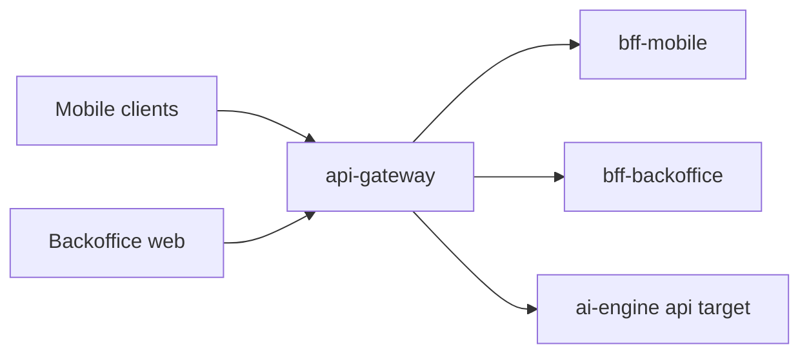

# api-gateway

Last updated: 2026-05-08.

Single edge gateway for AxiomNode public traffic.

## Responsibility

`api-gateway` is the public edge boundary for the platform. It is responsible for exposing stable public routes while keeping downstream services private and replaceable.

In the current staging topology it also acts as the live runtime holder for the active `ai-engine` upstream when the engine runs outside the cluster.

## Runtime role

### Runtime context

### Main responsibilities

- Expose a unified entry point for mobile and backoffice clients.
- Apply edge concerns: auth, CORS, rate limits, and request tracing.
- Route requests to channel-specific BFF services.
- Provide the stable internal ai-engine upstream used by cluster services when ai-engine runs externally on an optional workstation.

## Runtime surface

### Concrete upstream model

`api-gateway` has three distinct forwarding roles:

1. client edge routing toward `bff-mobile`
2. client edge routing toward `bff-backoffice`
3. internal ai-engine proxying toward the active AI API and stats target

That third role matters operationally because the gateway can expose stable internal AI routes while the actual AI upstream host changes over time.

Route inventory, forwarding semantics, and runtime target behavior are documented in the local docs and in the public-edge capability dossier so this README can stay focused on repository role.

Backoffice role routes are forwarded without owning role policy. `GET /v1/backoffice/admin/users/roles` can be used by `SuperAdmin` and `Inspector` after downstream validation, while role mutation remains a `SuperAdmin` operation in `microservice-users`.

## Local setup

### Repository structure

- `src/`: Fastify + TypeScript implementation.
- `docs/`: architecture, guides, and operations notes.
- `.github/workflows/ci.yml`: repository CI and deployment dispatch trigger.

### Primary use cases

- route public mobile requests toward `bff-mobile`
- route protected backoffice requests toward `bff-backoffice`
- proxy internal ai-engine traffic toward the active runtime target
- expose health checks and hold the persisted ai-engine routing state

### Local development

1. `cd src`
2. `cp .env.example .env`
3. `npm install`
4. `npm run dev`

### Route note

The gateway owns public `/v1/mobile/*`, `/v1/backoffice/*`, internal `/internal/ai-engine/*`, and privileged runtime-target routes. See `docs/architecture/README.md` and the edge capability dossier for the concrete inventory.

### Runtime routing persistence

- The live ai-engine target is persisted in `GATEWAY_ROUTING_STATE_FILE`.
- This state survives pod recreation and process restart.
- The gateway therefore owns effective ai-engine connectivity, not only the static environment default.

### Effective target resolution

Effective ai-engine traffic resolves from persisted runtime override first and environment-derived default second, which is why this repository owns a live routing decision beyond static manifests.

## Documentation

- `docs/README.md`
- `docs/architecture/README.md`
- `docs/guides/README.md`
- `docs/operations/README.md`

## Dependencies and contracts

### Dependency surface

Primary downstream dependencies:

- `bff-mobile`
- `bff-backoffice`
- active `ai-engine-api` target
- active `ai-engine-stats` target

## Deployment and operations notes

### Operational constraints

- `api-gateway` is part of the automatic GHCR-to-k3s staging rollout chain.
- The gateway image can be redeployed independently from the actual ai-engine runtime location.
- When `ai-engine` is externalized, a healthy gateway rollout does not by itself guarantee healthy ai-engine connectivity; the active runtime target must also be valid.

### CI/CD and rollout note

CI and rollout behavior are documented in `docs/operations/README.md` and `../docs/operations/cicd-workflow-map.md`.

### Failure boundaries

- edge policy failure before forwarding
- BFF reachability failure
- ai-engine target points to an unreachable or wrong upstream
- upstream timeout or slow-response degradation

### Repository-local documentation scope

This repository should stay concrete about:

- exposed edge and internal AI routes
- gateway-owned routing state
- target resolution behavior
- repo-local CI and deployment gates

### Key environment variables

- `ALLOWED_ORIGINS`
- `BFF_MOBILE_URL`
- `BFF_BACKOFFICE_URL`
- `EDGE_API_TOKEN`
- `AI_ENGINE_API_URL`
- `AI_ENGINE_STATS_URL`
- `GATEWAY_ROUTING_STATE_FILE`
- `ALLOWED_ROUTING_TARGET_HOSTS`
- `API_GATEWAY_ADMIN_TOKEN`

## References

- `docs/architecture/`
- `docs/operations/`
- `../docs/guides/capabilities/edge/public-edge-routing.md`
- `../docs/operations/cicd-workflow-map.md`
