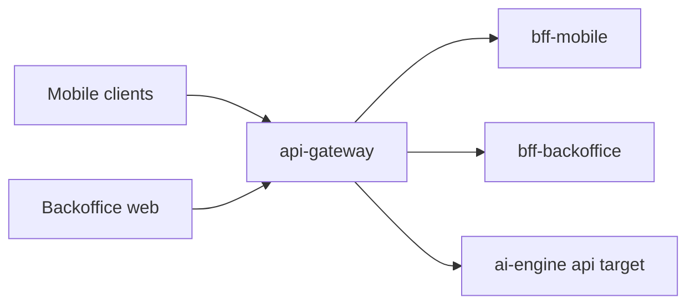

# api-gateway

Single edge gateway for AxiomNode public traffic.

## Architectural role

`api-gateway` is the public edge boundary for the platform. It is responsible for exposing stable public routes while keeping downstream services private and replaceable.

In the current staging topology it also acts as the live runtime holder for the active `ai-engine` upstream when the engine runs outside the cluster.

## Runtime context

## Responsibilities

- Expose a unified entry point for mobile and backoffice clients.
- Apply edge concerns: auth, CORS, rate limits, and request tracing.
- Route requests to channel-specific BFF services.
- Provide the stable internal ai-engine upstream used by cluster services when ai-engine runs externally on an optional workstation.

## Repository structure

- `src/`: Fastify + TypeScript implementation.
- `docs/`: architecture, guides, and operations notes.
- `.github/workflows/ci.yml`: repository CI and deployment dispatch trigger.

## Primary use cases

- route public mobile requests toward `bff-mobile`
- route protected backoffice requests toward `bff-backoffice`
- proxy internal ai-engine generation, ingest, catalogs, and stats traffic
- expose health checks for deployment smoke validation
- hold and persist the live ai-engine target selected by operations

## Local development

1. `cd src`
2. `cp .env.example .env`
3. `npm install`
4. `npm run dev`

## Main routes

- `GET /health`
- `GET /v1/mobile/games/quiz/random`
- `GET /v1/mobile/games/wordpass/random`
- `POST /v1/mobile/games/quiz/generate`
- `POST /v1/mobile/games/wordpass/generate`
- `GET /v1/backoffice/users/leaderboard`
- `GET /v1/backoffice/monitor/stats`
- `POST /internal/ai-engine/generate/quiz`
- `POST /internal/ai-engine/generate/word-pass`
- `POST /internal/ai-engine/ingest/quiz`
- `POST /internal/ai-engine/ingest/word-pass`
- `GET /internal/ai-engine/catalogs`
- `GET /internal/ai-engine/health`
- `GET /internal/ai-engine/stats`
- `GET|PUT|DELETE /internal/admin/ai-engine/target`

The ai-engine target managed through `/internal/admin/ai-engine/target` is intentionally not restricted by `ALLOWED_ROUTING_TARGET_HOSTS`. That allowlist still applies to generic service-target overrides, but ai-engine must remain movable to any reachable host chosen from backoffice.

## Runtime routing persistence

- The live ai-engine target is persisted in `GATEWAY_ROUTING_STATE_FILE`.
- This state survives pod recreation and process restart.
- The gateway therefore owns effective ai-engine connectivity, not only the static environment default.

## Operational constraints

- `api-gateway` is part of the automatic GHCR-to-k3s staging rollout chain.
- The gateway image can be redeployed independently from the actual ai-engine runtime location.
- When `ai-engine` is externalized, a healthy gateway rollout does not by itself guarantee healthy ai-engine connectivity; the active runtime target must also be valid.

## CI/CD workflow behavior

- `ci.yml`
	- Trigger: push (`main`, `develop`), pull request, manual dispatch.
	- Job `build-test-lint`: checks out `shared-sdk-client` with `CROSS_REPO_READ_TOKEN`, blocks tracked `src/node_modules` / `src/dist`, then runs install, build, test, lint, and production `npm audit --omit=dev --audit-level=high`.
	- Job `trigger-platform-infra-build`:
		- Runs on push to `main`.
		- Waits for `build-test-lint` to succeed before dispatching `platform-infra`.
		- Dispatches `platform-infra/.github/workflows/build-push.yaml` with `service=api-gateway`.
		- Requires `PLATFORM_INFRA_DISPATCH_TOKEN` in this repo.

## Deployment automation chain

1. Push to `main` in this repo.
2. Repo CI validates build, tests, lint, and audit.
3. Repo CI dispatches image build in `platform-infra` only if validation is green.
4. `platform-infra` build publishes GHCR images.
5. `platform-infra` deploy workflow rolls out automatically to `stg`.

## Failure interpretation

- If repository CI fails, no image is published from that push.
- If `platform-infra` build fails, GHCR publication stops there.
- If staging deploy fails, rollout diagnostics live in `platform-infra`, not in this repository.

## Key environment variables

- `ALLOWED_ORIGINS`
- `BFF_MOBILE_URL`
- `BFF_BACKOFFICE_URL`
- `EDGE_API_TOKEN`
- `AI_ENGINE_API_URL`
- `AI_ENGINE_STATS_URL`
- `GATEWAY_ROUTING_STATE_FILE`
- `ALLOWED_ROUTING_TARGET_HOSTS`
- `API_GATEWAY_ADMIN_TOKEN`

## Related documents

- `docs/architecture/`
- `docs/operations/`
- `../docs/operations/cicd-workflow-map.md`
